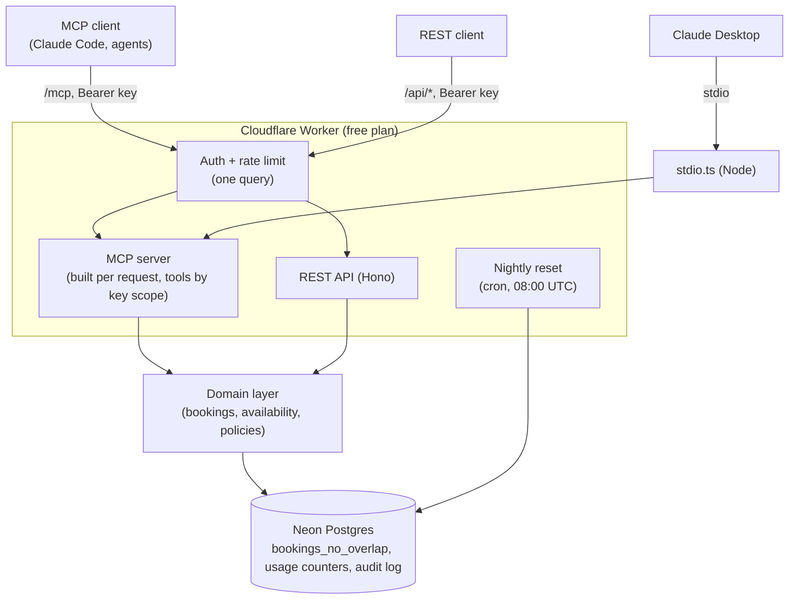

# booking-mcp

[](https://github.com/Azeem-Subhani/booking-mcp/actions/workflows/ci.yml)

A booking API for appointment-based businesses, built so an AI assistant can drive it safely over the
Model Context Protocol (MCP). The demo tenant is Northside Studio, a fictional fitness studio in New York.

**Live:** `https://booking-mcp.azeemsubhani.workers.dev` (MCP at `/mcp`, REST at `/api/*`). It runs on
free tiers only: Cloudflare Workers, Neon Postgres, and GitHub Actions.


*A booking in Claude, shown at 3x speed. The customer is fictional.*

## What this project demonstrates

- **Tools designed for an LLM.** Booking takes two steps, hold then confirm, so the model has to read
  the details back to the customer before anything is final. Expected failures return stable codes the
  model can act on, and policies come from the server rather than the model's guesses.
- **Rules enforced by the database, not the prompt.** Postgres rejects double-booking with an exclusion
  constraint, however many requests or Worker instances race.
- **Least privilege per API key.** A read-only key never sees write tools, and looking up a customer by
  email needs a write key.
- **Operations for a public demo.** Per-key rate limits with a daily cap, an audit log of every tool call
  with customer details redacted, and a nightly reset of the sandbox.
- **Tests that catch real failure modes.** They run on in-memory Postgres and on a real Postgres 18 in
  CI. That includes deterministic two-session concurrency tests and a non-UTC session time zone, which
  catches time zone bugs that a UTC-only test database would miss.

## Architecture



The domain layer runs unchanged on Workers and Node. It uses only Web APIs, and the database sits behind
a one-method interface, so the same code runs on Neon in production and on PGlite or Postgres in tests.

## Connect an MCP client

Every request needs an API key, sent as `Authorization: Bearer <key>`. Keys are scoped to one tenant and
are either read or write.

**Try the live demo:** a read-only demo key (30 requests a minute, 1,000 a day, shared by everyone) is
published on the case study on [my portfolio](https://azeem-subhani.vercel.app/projects). It's kept out
of this repository on purpose.

**Claude Code** (remote, over HTTP):

```bash
claude mcp add --transport http booking https://booking-mcp.azeemsubhani.workers.dev/mcp --header "Authorization: Bearer <your key>"
```

**Claude Desktop, against the live demo** (no database needed). Claude Desktop's config file only
starts local servers, so [`mcp-remote`](https://www.npmjs.com/package/mcp-remote) bridges stdio to the
remote endpoint and adds the key header. Add this to `claude_desktop_config.json` and restart Claude
Desktop. It needs Node 18 or later.

```json
{
  "mcpServers": {
    "booking": {
      "command": "npx",
      "args": [
        "-y",
        "mcp-remote@0.14.3",
        "https://booking-mcp.azeemsubhani.workers.dev/mcp",
        "--header",
        "Authorization:${AUTH_HEADER}"
      ],
      "env": {
        "AUTH_HEADER": "Bearer <your key>"
      }
    }
  }
}
```

- The version is pinned on purpose. `mcp-remote` is a third-party package, and the bridge sees your key.
- The header has no space after the colon, and the space lives in `AUTH_HEADER` instead. Claude
  Desktop on Windows doesn't escape spaces inside `args`.
- With the read-only demo key you get the four read tools: policies, services, availability, and
  booking lookup. Holding and confirming need a write key, which means running your own copy.

**Claude Desktop, against your own database** (local, over stdio). Add this to
`claude_desktop_config.json`. It needs Node 24, which runs the TypeScript entry directly.

```json
{
  "mcpServers": {
    "booking": {
      "command": "node",
      "args": ["/absolute/path/to/booking-mcp/src/stdio.ts"],
      "env": {
        "DATABASE_URL": "<your Postgres connection string>",
        "BOOKING_API_KEY": "<a key from npm run seed>"
      }
    }
  }
}
```

The stdio entry connects to the database directly, so it isn't rate limited. Anyone running it already
holds the connection string.

## MCP tools

| Tool | Scope | Annotations |
|---|---|---|
| `get_policies` | read | read-only |
| `list_services` | read | read-only |
| `search_availability` | read | read-only |
| `get_booking` | read | read-only |
| `find_bookings_by_email` | write | read-only |
| `hold_slot` | write | idempotent with a key |
| `confirm_booking` | write | idempotent |
| `reschedule_booking` | write | destructive |
| `cancel_booking` | write | destructive, idempotent |

- **Policies:** `get_policies` gives the model the business's time zone, hold length (10 minutes), and
  cancellation notice (24 hours). The same data is the `booking://policies` resource, but some clients
  (Claude Desktop among them) only let the user attach resources, so the tool is what the model can
  reach on its own. `search_availability` also returns `timeZone` next to the UTC slots. The server
  instructions tell the model to quote these rather than invent policies.
- **Read-back details:** every booking a tool returns carries `details` with the service name, price,
  weekday, and local start, end, and hold expiry (with UTC offset), so the model can read a hold back
  to the customer without joining services or converting from UTC.
- **Errors:** expected failures come back as tool errors with a stable code (`slot_unavailable`,
  `hold_expired`, `policy_violation`, ...) so the model can recover, for example by searching again.
  Unexpected errors are logged, and the model gets a generic message with no database details.

## Safety and operations

| Concern | How it's handled |
|---|---|
| Authentication | API keys are stored only as SHA-256 hashes, and each raw key is shown once at creation. Unknown and revoked keys get 401. |
| Authorization | Each key is read or write and bound to one tenant. Write tools aren't registered for read keys, and every query is scoped by tenant. |
| Rate limiting | Fixed-window counters in Postgres: a per-minute limit on every key, plus an optional daily cap (resets 00:00 UTC). Over the limit returns 429 with `Retry-After`. The key lookup and the count are one statement. |
| Audit | Every MCP tool call records the key, tool, inputs, result code, and duration. Customer names and emails are redacted before storage. Rows are kept for 30 days. |
| Sandbox reset | A Cron Trigger at 08:00 UTC deletes the demo tenant's bookings and prunes old counters and audit rows, in one statement. |
| Secrets | `DATABASE_URL` is a Worker secret. Local secrets live in `.dev.vars` (gitignored), and the scripts never print them. |

## Design notes

**Why the database prevents overlaps.** Checking availability in code and then inserting leaves a gap
where two requests can both pass the check. The `bookings_no_overlap` exclusion constraint makes
Postgres reject the second insert, so the guarantee holds however many Worker instances are running.
`tests/concurrency.test.ts` proves it with two real sessions: one holds a slot in an open transaction,
and the other is confirmed to be waiting on its lock before the first commits.

**Expired holds.** A hold past its expiry no longer blocks the slot. Writes flip stale holds to
`expired` before inserting, and availability and confirm both compare against the current time.

**Time zones.** Opening hours are stored as local wall-clock times. All conversion happens in Postgres
with the tenant's IANA zone, so the database's time zone data handles DST, not hand-written offsets.
The code never relies on the Postgres session time zone. The real-Postgres test run checks this by
using `Pacific/Auckland` as the session zone.

**A fresh MCP server per request.** The server is stateless and rebuilt for each request from the
caller's key, so a read key can never be served write tools from a previous request. Anything that
doesn't depend on the key, such as the input schemas, is built once per isolate.

**Staying on the free plan.** Each Neon query costs about 1 ms of Worker CPU, against the Free plan's
10 ms limit. Combining authentication and rate limiting into one statement brought warm requests to
1 to 2 ms (REST) and 3 to 6 ms (MCP), measured with `wrangler tail`.

## REST API

All routes need `Authorization: Bearer <api key>`.

| Method | Path | Scope |
|---|---|---|
| GET | `/api/services` | read |
| GET | `/api/services/:id/availability?from=YYYY-MM-DD&to=YYYY-MM-DD` | read |
| GET | `/api/bookings/:id` | read |
| GET | `/api/bookings?email=` | write |
| POST | `/api/holds` (needs `Idempotency-Key` header) | write |
| POST | `/api/bookings/:id/confirm` | write |
| POST | `/api/bookings/:id/reschedule` | write |
| POST | `/api/bookings/:id/cancel` | write |

Errors share one shape: `{ "error": { "code": "slot_unavailable", "message": "..." } }`.

## Development

```bash
npm install
npm test                 # Vitest on PGlite (in-memory Postgres)
npm run typecheck
npm run lint
npm run smoke            # boots the Worker in workerd and checks routing, no database
TEST_DATABASE_URL=postgres://postgres@localhost:5432/postgres npm run test:postgres   # real Postgres 18
```

Database setup, using `DATABASE_URL` from `.dev.vars`:

```bash
npm run migrate              # read-only: applied and pending migrations
npm run migrate -- apply     # apply pending migrations, each in its own transaction
npm run seed                 # demo tenant and demo keys (raw keys go to .dev.vars, never printed)
```

CI runs two jobs on every PR and push to `main`, and both must pass before merging:
- **`checks`:** lint, typecheck, tests on PGlite, and the smoke test.
- **`test-postgres`:** the full suite against a `postgres:18.6` container. Each test gets its own
  database in a non-UTC session time zone.

## Known limitations

- **Cold starts.** The first request on a fresh Worker isolate can use more than 10 ms of CPU (about
  16 ms measured). Every request has succeeded so far, but Cloudflare doesn't document how much leeway
  the Free plan allows.
- **Shared demo key.** The public demo key is shared, so one user can use up its daily cap for everyone.
- **Audit gaps.** Calls rejected by schema validation, and calls to tools a key doesn't have, aren't
  audited yet.
- **Driver coverage.** CI tests a real Postgres server but not Neon's HTTP driver. That path was checked
  end to end against Neon before deploying.
- **No payments yet.** `create_payment_link` (Stripe test mode) is planned. Group classes are out of
  scope for v1: the constraint models one booking per resource at a time.

## Stack

TypeScript, Hono, Zod, MCP TypeScript SDK v2, Postgres (Neon in production, PGlite and Postgres 18 in
tests), Vitest, Cloudflare Workers (Wrangler), GitHub Actions.

## License

MIT
